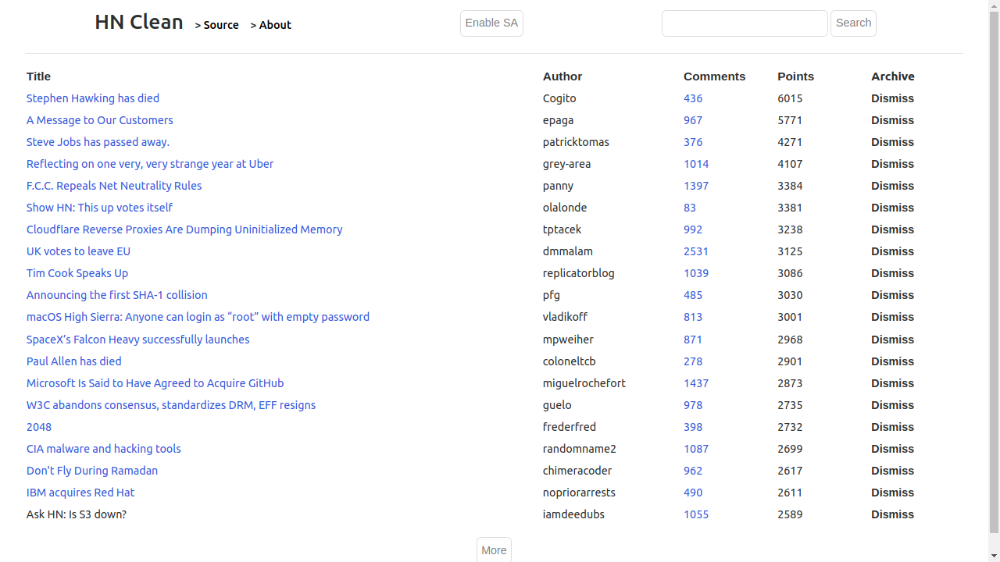
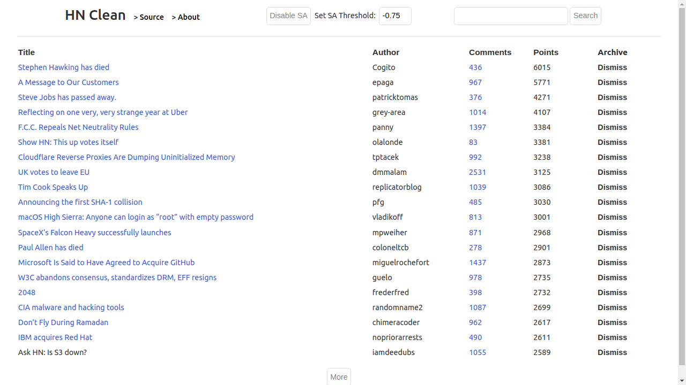
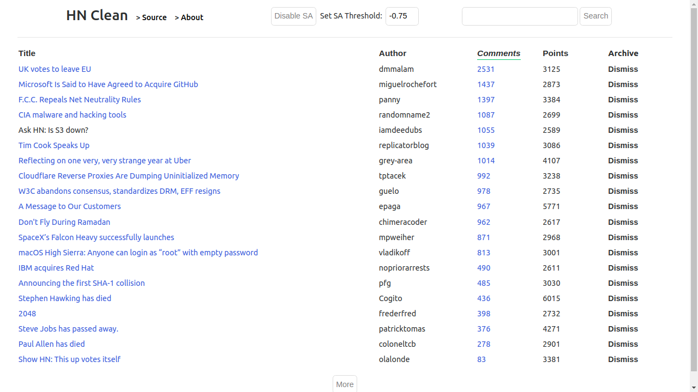
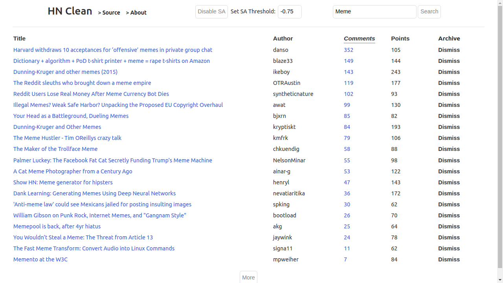
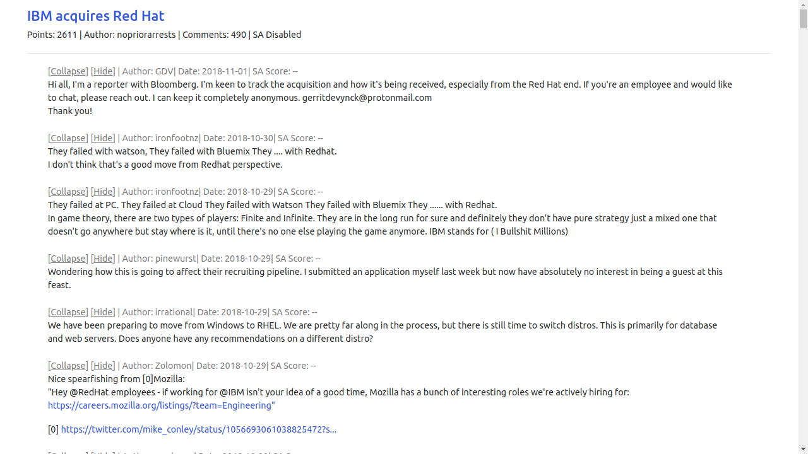
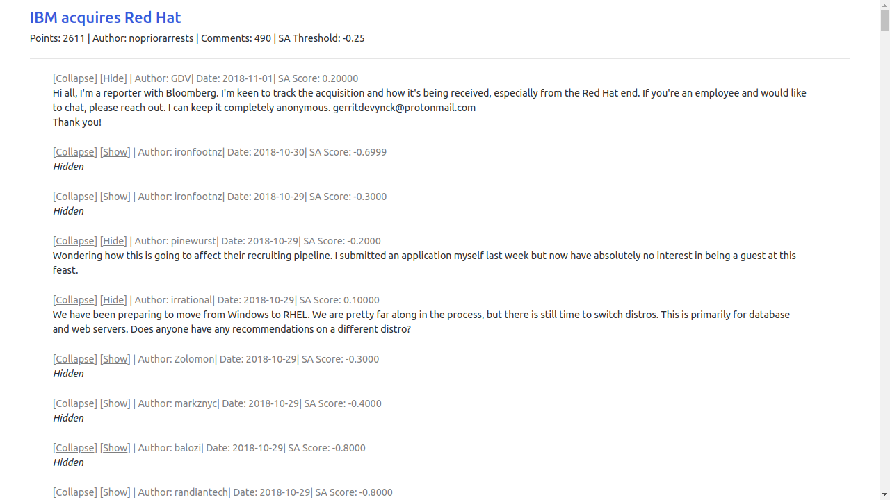

# HN-Clean

> A customized Hackernews client that collapse negative comments based on user-defined threshhold.

### Overview
- Frontend: React
- Backend: Express/Node
- Sentiment analysis: GCP NL client library

---

### Demo

##### Main page

This is the main page of the application.

You can enable sentiment analysis by clicking the `Enable SA` button and set your threshold (default = -0.75).

You can sort the content by clicking the column header.

The search bar uses the [Hacker News algolia search API](https://hn.algolia.com/api).

### Comment Page

Leaving SA disabled, the app is basically Hacker News without comments or user profile. If you only browse and rarely comment (like me), this can be used as a lightweight HN client.

If SA is enabled, each comment is analyzed by Google Natural Language client library (see other section for more info); comments with a score below your threshold will be collapsed automatically. The `Collapse` button represents the `[-]` on HN or reddit where the comment (and all of its descendents) are collapsed; the `Show/Hide` button are used for SA purpose. 

---

### Sentiment Analysis

---
> Gonna finish the rest of README soon.
